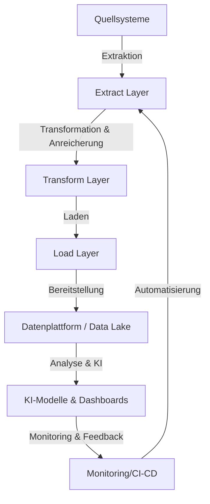

# Architektur der Data & KI-Plattform

## Übersicht
Die Architektur dieser Data & KI-Plattform ist modular aufgebaut und unterstützt den gesamten Lebenszyklus von Daten – von der Extraktion über die Verarbeitung und Anreicherung bis hin zur Bereitstellung für Analyse und KI-Anwendungen. Sie ist auf Skalierbarkeit, Automatisierung und Zusammenarbeit ausgelegt.

## Architekturdiagramm

## Komponentenbeschreibung

### 1. Quellsysteme
- Interne und externe Datenquellen (Datenbanken, APIs, Dateien, etc.)

### 2. Extract Layer
- Extraktion der Rohdaten aus den Quellsystemen
- Beispiel: `src/extract.py`

### 3. Transform Layer
- Transformation, Bereinigung und Anreicherung der Daten
- Anwendung von KI-Methoden (z. B. Feature Engineering, NLP)
- Beispiel: `src/transform.py`, `src/model.py`

### 4. Load Layer
- Laden der verarbeiteten Daten in Zielsysteme (z. B. Data Lake, DWH)
- Beispiel: `src/load.py`

### 5. Datenplattform / Data Lake
- Speicherung und Verwaltung der harmonisierten Daten
- Ermöglicht Self-Service-Analytics und KI

### 6. KI-Modelle & Dashboards
- Nutzung der Daten für Machine Learning, Klassifikation, Visualisierung
- Beispiel: `src/model.py`, externe Dashboards

### 7. Monitoring, CI/CD & Automatisierung
- Überwachung der Datenqualität und Pipeline-Performance
- Automatisierte Tests, Deployments und Fehlerbenachrichtigung

## Technologiestack
- Python, SQL, Spark (optional), Suchmaschinentechnologien
- Cloud-Services (optional, z. B. für Skalierung und Storage)
- CI/CD-Tools (z. B. GitHub Actions)
- Monitoring (z. B. Prometheus, ELK-Stack)

## Erweiterbarkeit & Zusammenarbeit
- Modularer Aufbau für einfache Erweiterung
- Dokumentierte Schnittstellen für Zusammenarbeit mit AI-, Produkt- und Software-Teams
- Architekturentscheidungen werden versioniert dokumentiert

---

*Dieses Dokument dient als zentrale Übersicht der Architektur und kann für Präsentationen, Onboarding und Weiterentwicklung genutzt werden.*
